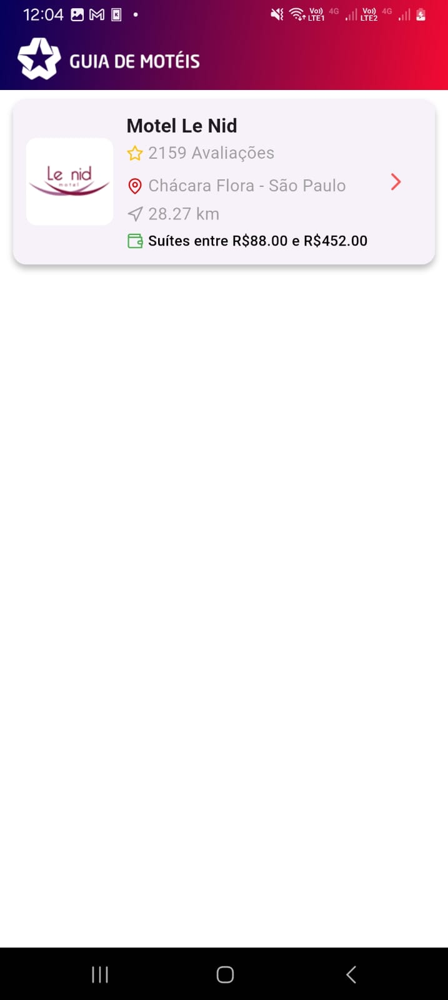

# 🏨 Guia de Motéis

Bem-vindo ao Guia de Motéis, o aplicativo perfeito para encontrar os melhores motéis da sua região! Com uma interface intuitiva e informações detalhadas, você pode explorar suítes, ver preços, horários e muito mais.

## ✨ Funcionalidades Principais

- **Busca de Motéis**: Encontre motéis próximos com facilidade.
- **Detalhes Completos**: Veja fotos, preços, horários e avaliações de cada suíte.
- **Tabela de Preços**: Confira os valores de cada período de hospedagem.
- **Interface Moderna**: Design limpo e fácil de usar.

## 🛠️ Tecnologias Utilizadas

- **Flutter**: Framework para desenvolvimento multiplataforma.
- **Dart**: Linguagem de programação utilizada.
- **Lucide Icons**: Ícones modernos e elegantes.
- **HTTP**: Para integração com APIs.
- **Gradient AppBar**: Design personalizado com gradientes.
- **Riverpod**: Para gerenciamento de estado eficiente.

## 📥 Como Baixar e Instalar o APK

Para testar o aplicativo, baixe o APK diretamente do Google Drive:

👉 [Baixar APK](https://drive.google.com/file/d/1kxDlCQhi0V0XM4q1skWLxW4e5NxwIgg8/view?usp=sharing)

### Passos para Instalação:

1. Baixe o arquivo APK no link acima.
2. No seu dispositivo Android, vá até Configurações > Segurança e habilite a instalação de aplicativos de fontes desconhecidas.
3. Localize o arquivo APK baixado e toque nele para instalar.
4. Pronto! Agora você pode abrir o app e começar a usar.

## 📸 Capturas de Tela

     

  

  
  
  

